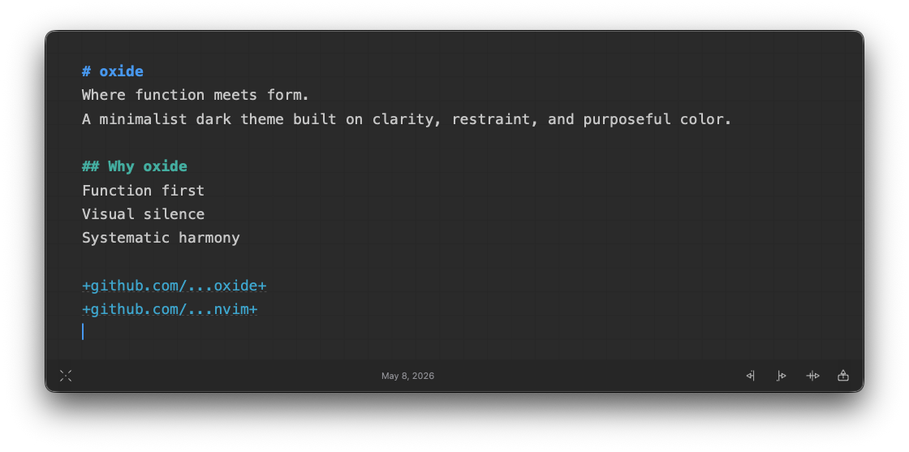

# oxide for Antinote

<h6 align="center">
Where function meets form.
</h6>

  
  
  

<!-- Optional but recommended: Add screenshots here

  

-->

*oxide* for [Antinote](https://antinote.io/) brings the oxide colorscheme to a beautiful productivity scratchpad.
A minimalist dark theme built around clarity and restraint, using a deep near-black background, crisp white foregrounds, and vibrant accent colors to emphasize structure without visual noise.

## Design Philosophy

oxide is built on three core principles:

- **Function first**: Every color exists to convey information
- **Visual silence**: Elegance emerges from what is intentionally omitted
- **Systematic harmony**: Every color relates predictably to the others

The full design philosophy and color system are documented in the [main oxide repository](https://github.com/oxidescheme/oxide).

## Installation

1. Download `oxide.json` from this repository
2. Open Antinote settings
3. Go to **Visuals** and scroll to **Custom Themes**
4. Click **Open Folder** and place `oxide.json` in that folder
5. Select **Oxide** in the theme list

## Contributing

We follow the same philosophy as the main oxide project: minimalism doesn't mean stagnation.

- Report issues through [GitHub Issues](https://github.com/oxidescheme/antinote/issues)
- PRs that improve clarity and consistency are welcome
- Ensure changes align with oxide's functional aesthetic

## Credits

- **Port Creator:** [@jakmaz](https://github.com/jakmaz)
- **Current Maintainer:** [@jakmaz](https://github.com/jakmaz)
- **Contributors:** See [contributors list](https://github.com/oxidescheme/antinote/graphs/contributors)

## License

MIT License - see [LICENSE](LICENSE) for details.

Copyright &copy; 2025-present oxidescheme

